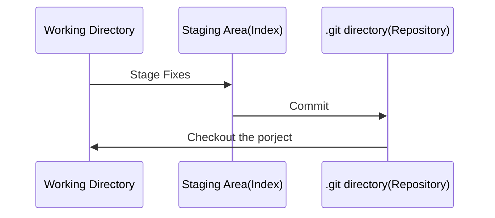

# The three states of git

#### **#git**

---

git托管的文件的三种状态

- Working Direcotry

  这个就是工作区了，当我们随意编辑完文件后，这个区域就记录下了我们所有的改动。

- Staging Area(Index)

  这个暂存区呢，需要我们通过`git add .`这个操作，将文件从工作区转移到该区，这里是你下次提交的修改文件

- .git direcotry

  提交更新后，这里会记录下你每次的提交历史，十分重要